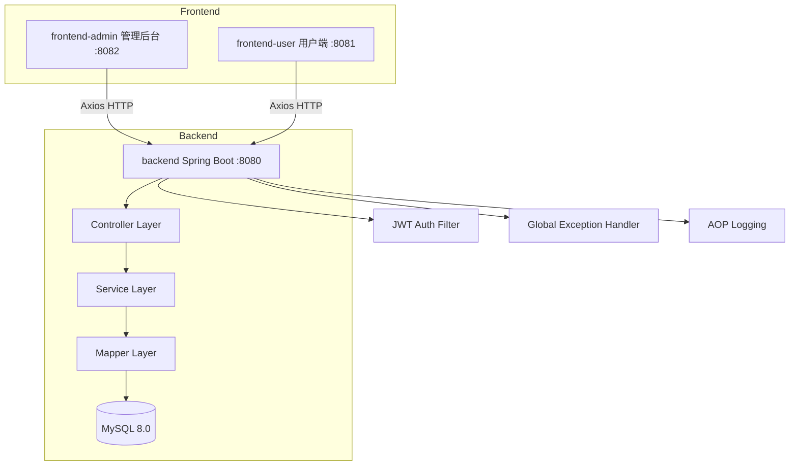
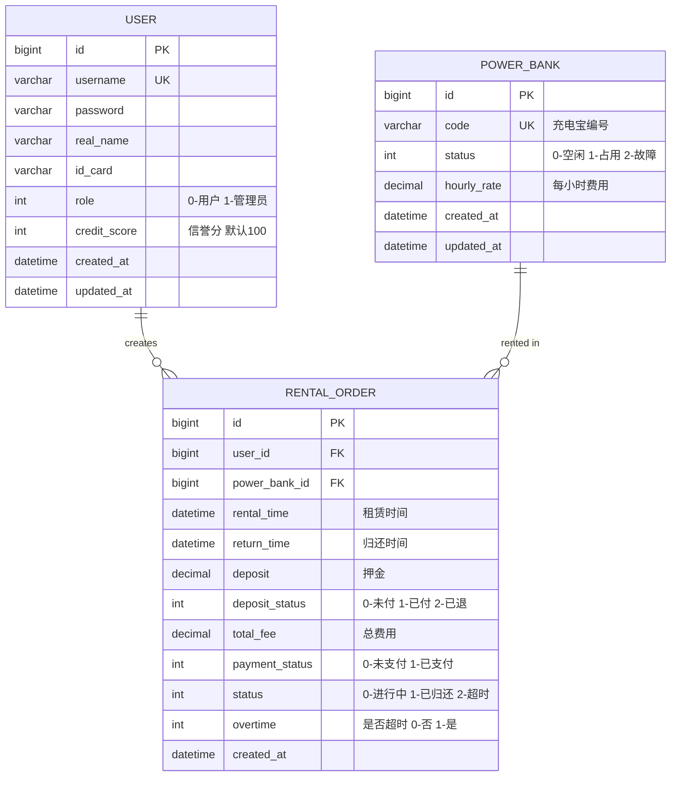

# 充电宝租赁管理系统 - 项目设计文档

## 1. 系统架构

## 2. ER 图

## 3. 接口清单

### AuthController
| Method | Path | Description |
|--------|------|-------------|
| POST | /api/auth/login | 登录 |
| POST | /api/auth/register | 注册 |

### UserController
| Method | Path | Description |
|--------|------|-------------|
| GET | /api/user/info | 获取当前用户信息 |
| PUT | /api/user/profile | 修改用户信息 |
| PUT | /api/user/password | 修改密码 |
| GET | /api/user/list | 管理员-用户列表 |
| GET | /api/user/search | 管理员-搜索用户 |

### PowerBankController
| Method | Path | Description |
|--------|------|-------------|
| GET | /api/powerbank/available | 用户-可用充电宝列表 |
| GET | /api/powerbank/list | 管理员-所有充电宝 |
| POST | /api/powerbank | 管理员-新增充电宝 |
| PUT | /api/powerbank/{id} | 管理员-修改充电宝 |
| PUT | /api/powerbank/{id}/status | 管理员-修改状态 |
| GET | /api/powerbank/search | 按编号查询 |

### RentalController
| Method | Path | Description |
|--------|------|-------------|
| POST | /api/rental/rent | 租赁充电宝 |
| PUT | /api/rental/return/{id} | 归还充电宝 |
| PUT | /api/rental/pay/{id} | 支付订单 |
| GET | /api/rental/my-orders | 我的订单 |
| GET | /api/rental/current | 当前进行中订单 |
| GET | /api/rental/list | 管理员-所有订单 |
| GET | /api/rental/search | 查询租赁记录 |

## 4. UI/UX 规范

- 主色调: #409EFF (蓝色系)
- 成功色: #67C23A
- 警告色: #E6A23C
- 危险色: #F56C6C
- 文字主色: #303133
- 文字次色: #909399
- 背景色: #F5F7FA
- 卡片圆角: 8px
- 卡片阴影: 0 2px 12px rgba(0,0,0,0.1)
- 间距基准: 8px / 16px / 24px
- 字体: -apple-system, BlinkMacSystemFont, "Segoe UI", "PingFang SC"
